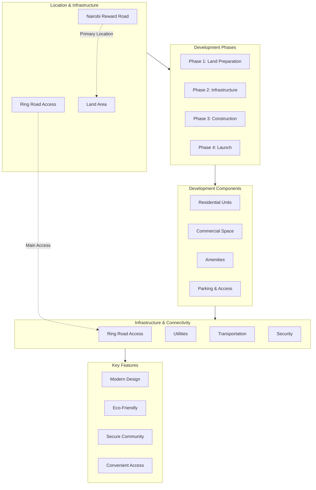

# Real Estate Development - Nairobi Reward Road

## Project Overview
Upcoming real estate development project located at Nairobi Reward Road with strategic Ring Road connectivity passing through the development area.

## Development Architecture

## Key Highlights

### Location Benefits
- **Nairobi Reward Road**: Prime location in Nairobi
- **Ring Road Access**: Direct connectivity via Ring Road passing through the development
- **Strategic Position**: Central location with excellent accessibility

### Development Phases
1. **Phase 1**: Land Preparation & Feasibility Studies
2. **Phase 2**: Infrastructure Development (Roads, Utilities, Drainage)
3. **Phase 3**: Residential & Commercial Construction
4. **Phase 4**: Project Launch & Handover

### Components
- **Residential Units**: Modern apartments and villas
- **Commercial Space**: Retail and office spaces
- **Amenities**: Parks, recreational facilities, community centers
- **Parking & Access**: Multi-level parking and well-planned access roads

### Infrastructure
- **Ring Road Connectivity**: Seamless access via Ring Road
- **Utilities**: Water, electricity, and sewerage systems
- **Transportation**: Public transport integration
- **Security**: Gated community with 24/7 security

### Key Features
- ✅ Modern architectural design
- ✅ Eco-friendly development
- ✅ Secure and gated community
- ✅ Convenient Ring Road access
- ✅ Complete amenities

## Contact & Information
For more details about this development project, please reach out to the project team.

---
*Last Updated: May 10, 2026*
